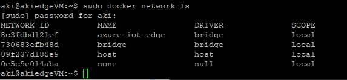
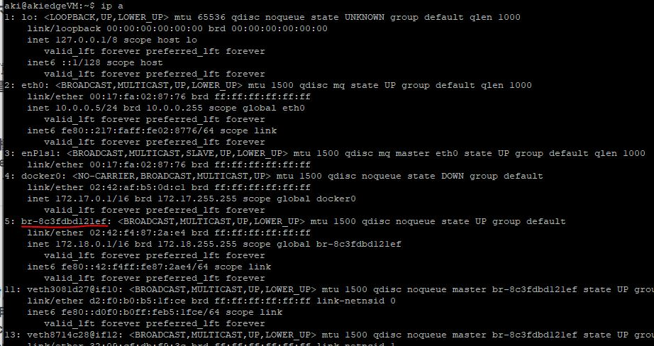
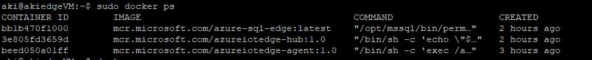
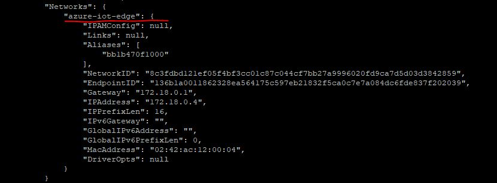
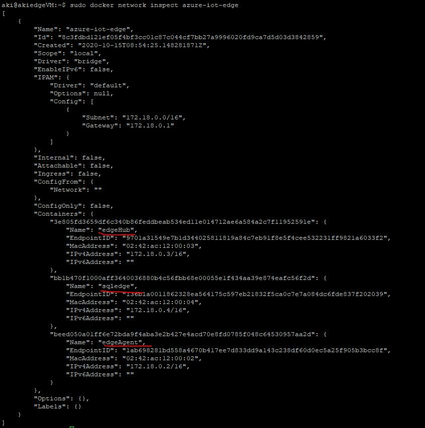
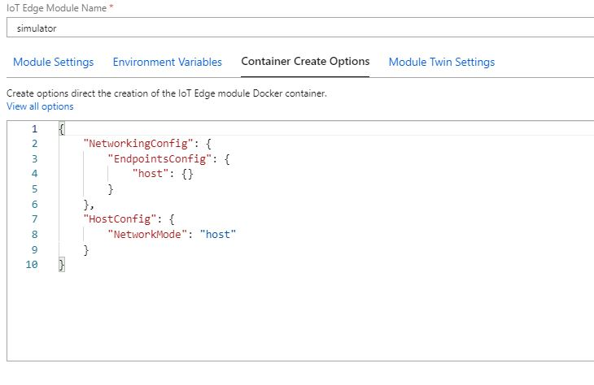

# Understand Azure IoT Edge Network


After installing IoT Edge, a default bridge 'azure-iot-edge' is created, check this by running the following command 

``` bash
sudo docker network ls
```




check the detail of 'azure-iot-edge'

```
ip a
```




list container id

```
docker ps
```




check iot edge network information for sqledge, sqledge is on 'azure-iot-edge' network as it is the default behavior.

```
docker inspect bb1b470f1000
```



If you check network setting for  EdgeHub and EdgeAgent, their network is also 'azure-iot-edge'


You can also use inspect to list this detail information of this bridge network properties

```
docker network inspect azure-iot-edge
```




**Access services hosted in edge module**

Because IoT Edge module containers are on the same Docker bridge network, they can communicate with each other using the container name and the port address for the service.

Take SQL Edge access as an example, if you have SQL Edge deployed on your iot edge device with default 'azure-iot-edge' network (document [here](https://docs.microsoft.com/en-us/azure/azure-sql-edge/deploy-portal)),  you can connect to this SQL server from different locations: 

- Inside the container
- From another Docker container running on the same host
- From the host machine
- From any other client machine on the network

please refer to this [doc](https://docs.microsoft.com/en-us/azure/azure-sql-edge/connect) for detail.


**Switch iot edge module to host mode**

Docker provide different types of network, if you want to change iot edge module to run in  mode other than using the default 'azure-iot-edge', you can set the network configuration via "create options" in the deployment. But in this case the container loses the ability to access other modules in the deployment directly by name.

To use host network mode:

```json
"createOptions": {
  "NetworkingConfig": {
    "EndpointsConfig": {
      "host": {}
    }
  },
  "HostConfig": {
    "NetworkMode": "host"
  }
}
```

For example change the network setting for a new module named 'simulator'



After this module is deployed, check the network 


**Windows**

On windows, IoT edge modules are attached to default 'nat' network.


